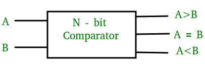
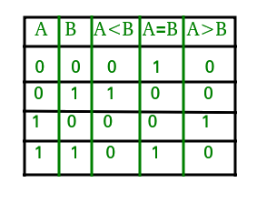
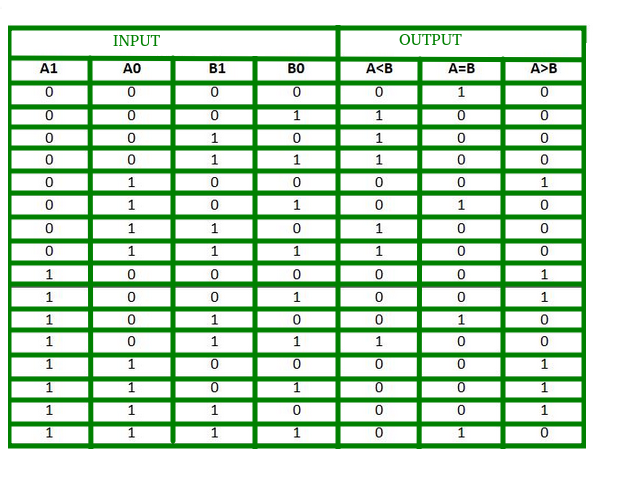
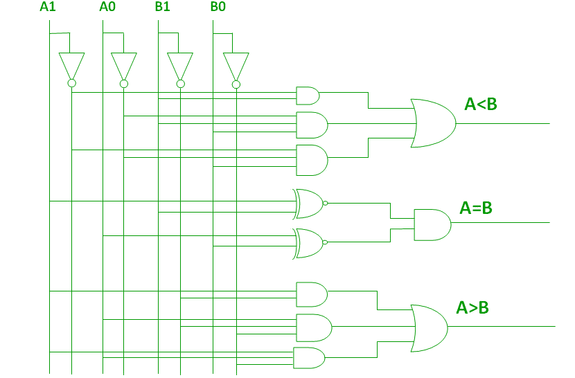

### Introduction

A magnitude digital comparator is a combinational circuit that compares two digital or binary numbers in order to find out whether one binary number is equal, less than or greater than the other binary number. We logically design a circuit for which we will have two inputs one for A and other for B and have three output terminals, one for A > B condition, one for A = B condition and one for A < B condition.  
                    	

 

<b>Figure-1: Block Diagram of Comparator </b>
 
 
      
  

### 1) 1-Bit Magnitude Comparator : 
A comparator used to compare two bits is called a single bit comparator. It consists of two inputs each for two single bit numbers and three outputs to generate less than, equal to and greater than between two binary numbers. The truth table for a 1-bit comparator is given below : 
					 	                    

  <b>Figure-2: Truth Table of 1-Bit Comparator</b>  

      

From the above truth table logical expressions for each output can be expressed as follows: 
A > B : AB' 
A < B : A'B 
A = B : A'B' + AB  
By using these Boolean expressions, we can implement a logic circuit for this comparator as given below : 
              	

  <b>Figure-3: Logic Circuit of 1-Bit Comparator</b> 

      
  

### 2) 2-Bit Magnitude Comparator :
A comparator used to compare two binary numbers each of two bits is called a 2-bit magnitude comparator. It consists of four inputs and three outputs to generate less than, equal to and greater than between two binary numbers. 

The truth table for a 2-bit comparator is given below: 

  <b>Figure-4: Truth Table of 2-Bit Comparator</b>
  
      

From the above truth table logical expressions for each output can be expressed as follows: 
A > B : A1B1’ + A0B1’B0’ + A1A0B0’ 
A = B : A1’A0’B1’B0’ + A1’A0B1’B0 + A1A0B1B0 + A1A0’B1B0’ 
   &nbsp;&nbsp;&nbsp;&nbsp;&nbsp;&nbsp;&nbsp;&nbsp;&nbsp;&nbsp;&nbsp;: A1’B1’ (A0’B0’ + A0B0) + A1B1 (A0B0 + A0’B0’) 
  &nbsp;&nbsp;&nbsp;&nbsp;&nbsp;&nbsp;&nbsp;&nbsp;&nbsp;&nbsp;&nbsp;: (A0B0 + A0’B0’) (A1B1 + A1’B1’) 
   &nbsp;&nbsp;&nbsp;&nbsp;&nbsp;&nbsp;&nbsp;&nbsp;&nbsp;&nbsp;&nbsp;: (A0 Ex-Nor B0) (A1 Ex-Nor B1) 
A < B : A1’B1 + A0’B1B0 + A1’A0’B0  
By using these Boolean expressions, we can implement a logic circuit for this comparator as given below :  
              	

  <b>Figure-5: Logic Circuit of 2-Bit Comparator</b>
 
      
  
### Applications of Comparators : 
1. Comparators are used in central processing units (CPUs) and microcontrollers (MCUs). 
2. These are used in control applications in which the binary numbers representing physical variables such as temperature, position, etc. are compared with a reference value. 
3. Comparators are also used as process controllers and for Servo motor control. 
4. Used in password verification and biometric applications.
      

